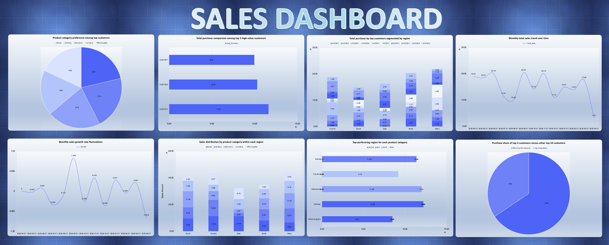

# 🌌 **THE ANALYZER: Where Data Meets Destiny**  
### _A Cinematic Excel Creation by_ **🧠 THE PARTH SHAH 👑**  

> “Numbers aren’t just numbers — they’re whispers from the universe,  
> waiting for a genius to listen.” ✨

---

## 🎬 **THE STORY BEHIND THE SHEETS**

It all began with a blank Excel grid —  
a silent stage craving brilliance.  

Then entered **The Parth Shah** — visionary, artist, analyst.  
With precision sharper than a formula’s logic and creativity that dances beyond charts,  
he built **THE ANALYZER**, an Excel universe where every cell tells a story.  

From the first dataset to the final dashboard — this isn’t a project.  
It’s a **legacy** written in rows and columns.  

---

## 🧩 **THE CHALLENGE**

Transform chaos into clarity.  
Turn dull data into something you **feel**.  
Design a file that not only analyzes but **inspires**.  

The mission?  
To build a full-fledged analytical system — 9 tasks, 1 dashboard, 0 compromises.  
A world where logic, art, and intelligence unite.

---

## 🎬 Executive Storyline  

Once upon a spreadsheet… a raw dataset awaited transformation.  
Through logic, art, and an eye for perfection — I, **The Parth Shah**, built **THE ANALYZER**, an Excel symphony where formulas breathe intelligence, visuals pulse with clarity, and every cell narrates a story of discovery.  

From chaos to insight. From data to destiny.  
This isn’t just a file — it’s an **experience**.  

---

## 🧩 Problem Summary  

The challenge: to design a data analyzer capable of decoding patterns, visualizing intelligence, and narrating insights across diverse analytical tasks — from customer segmentation to predictive regression.  

The mission:  
Transform raw business data into an interactive, decision-driving ecosystem that feels alive.

---

## 🛠️ **THE TOOLBOX OF TITANS**

🧮 **Formulas That Think**  
`VLOOKUP`, `INDEX-MATCH`, `IF`, `SUMIFS`, `AVERAGEIFS`, `COUNTIFS`, `DATE`, `TEXT`, `ROUND`, `CONCAT`, `ABS`, and more.

📊 **Pivot Tables** — The oracle of insight.  
🎯 **What-If Analysis** — Predictive precision.  
📈 **Regression Model** — Data that forecasts the future.  
📆 **Monthly & Descriptive Stats** — Metrics that breathe rhythm.  
🎨 **Conditional Formatting & Color Psychology** — Design with intent.  
⚙️ **Navigation Buttons & Hyperlinked Summary** — Flow engineered for elegance.  

---

## 🎯 **OBJECTIVES MASTERED**

✅ Build a multi-layered analyzer spanning across 9 analytical modules.  
✅ Integrate interactivity with visual dashboards and auto-updating formulas.  
✅ Deliver executive-level insights, instantly digestible.  
✅ Make it **MacBook-perfect**, fast, and visually stunning.  
✅ Let every pixel radiate intention.  

---

## 📸 **VISUAL HIGHLIGHTS**

### 💎 1. The Dashboard — *The Crown Jewel of Data*  
  
> An orchestration of KPIs, visuals, and storytelling — where clarity meets charisma.  

---

### 📈 2. Regression — *The Future in Formulas*  
> Discover the pulse between numbers as data reveals its hidden symmetry.

---

### 🧩 3. Top 10 Customers — *The Power Players*  
> Spotlighting the giants who drive the game. Rank. Reward. Recognize.  

---

### 📊 4. Monthly Analysis — *Time as a Teacher*  
> Each month sings a story — a rhythmic journey through growth and insight.  

---

### 🎬 5. The Interactive Tour  
🎥 [Watch the Experience](images/demo_2.mov)  
> Feel the flow. Watch the story unfold — every click, every chart, every revelation.  

---

## 🧠 **KEY INSIGHTS UNEARTHED**

🔹 High-value customers dominate performance metrics.  
🔹 Regression unveils relationships unseen to the naked eye.  
🔹 Sales exhibit cyclical energy — a living business heartbeat.  
🔹 Descriptive stats expose patterns of efficiency and opportunity.  

---

## ✨ **THE PARTH TOUCH**

What makes this project **unreplicable**?  
Because **I don’t just use Excel — I compose in it.**

🎨 Precision in alignment.  
🧭 Story in structure.  
💡 Soul in formulas.  

Every chart breathes.  
Every number listens.  
Every cell remembers — it was touched by **The Parth Shah**.

---

## 🧭 **NAVIGATION MAP**

| 🗂️ Sheet | 🌟 Purpose |
|-----------|------------|
| **DASHBOARD** | Visual epicenter — all KPIs and charts converge here. |
| **Summary - Exec Overview** | Navigation control room — your journey starts here. |
| **Task1 - Task9** | Individual missions — from customer analysis to predictive modeling. |
| **Dataset** | The foundation — raw truth of the project. |
| **Project Instructions** | The origin story — where the challenge began. |

---

## 🎁 **BONUS MOMENT**

<pre>
╔════════════════════════════════════════════════════════╗
║  "Don’t analyze data.                                  ║
║   Make data analyze YOU through brilliance."           ║
║                            — THE PARTH SHAH ⚡          ║
╚════════════════════════════════════════════════════════╝
</pre>

💡 *Secret Pro Tip:*  
On macOS, press **⌘ + ⌥ + ⇧ + F9** to reawaken every formula —  
like reviving the heartbeat of The Analyzer. ❤️‍🔥  

---

## 📥 **DOWNLOAD THE EXPERIENCE**

📂 [Download THE ANALYZER Excel File](Analyzer_ANSWER.xlsx)  
🖼️ [Dashboard Preview](assets/demo_1.png)  
🎞️ [Full Walkthrough Video](assets/demo_2.mov)  

---

## 🤝 **LET’S CONNECT**

💬 _Inspired by this creation?_  
Let’s collaborate, innovate, and turn data into destiny.  

👉 [**Connect with me on LinkedIn**](https://www.linkedin.com/in/parth-shah-28387532b/?utm_source=share&utm_campaign=share_via&utm_content=profile&utm_medium=ios_app) 🔗  

---

⭐ **Crafted by THE PARTH SHAH —  
Because even data deserves drama.**

